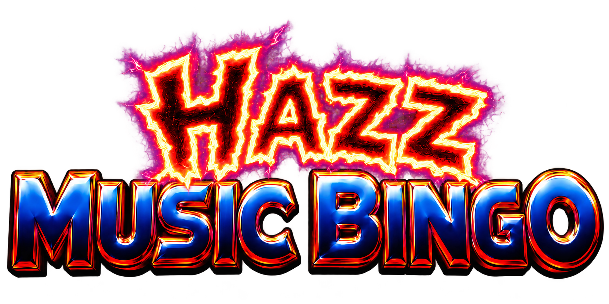
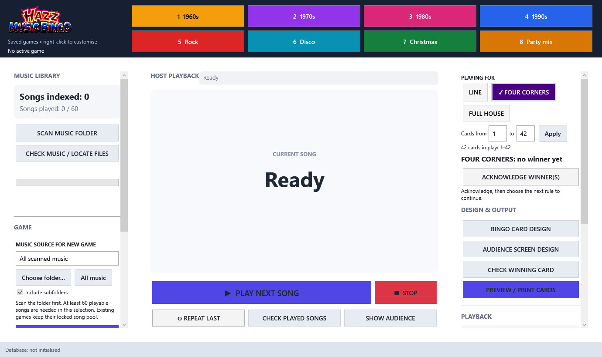

# Hazz Music Bingo v1.0

A Windows music-bingo host with custom 5×5 cards, print previews, an audience screen, missing-music checks and winner verification.

[Download Windows x64](https://github.com/harryoke/Hazz-Music-Bingo/releases/tag/v1.0) · [Quick start](docs/QUICK_START.md) · [User guide](docs/USER_GUIDE.md) · [Build and development](docs/DEVELOPMENT.md) · [Testing](docs/TESTING.md) · [Changes](CHANGELOG.md)

[Download the complete illustrated PDF manual](https://github.com/harryoke/Hazz-Music-Bingo/releases/download/v1.0/Hazz_Music_Bingo_v1.0_Complete_Manual.pdf) — 31 pages covering player rules, hosting, themes, printing, recovery, card randomisation and the game engine's maths.

## Copyright and licence

Copyright © 2026 Hazz Karaoke. Free use includes paid shows and business use. Unchanged copies may be shared free with all branding and notices intact. Redistribution of renamed, rebranded or modified versions requires written permission. Third-party licences and statutory rights remain unaffected. See [full licence terms](LICENSE.txt). This is source-available software, not an open-source licence.



## What it does

- Reads MP3 title/artist tags, with filename fallback.
- Generates games from a selected scanned folder, optionally including subfolders.
- Switches between eight labelled, coloured game buttons with saved audience themes and preserved progress.
- Styles eleven audience text elements independently: font, size, colour, bold, italic and outline colour/width.
- Starts clips at 0, 30, 60, 90 seconds or another 30-second step; Next and Repeat share the setting.
- Fixes silent audio when Next interrupts Repeat, including during fade-out.

- Locks a 60-song game and saves 60 distinct 25-song card layouts.
- Plays short clips with fade-out, Repeat and Stop; shows played songs on a separate audience display.
- Designs cards with installed fonts, themes, artwork, outlines, custom footers and spacing.
- Previews and prints card ranges at 1, 2 or 4 per sheet on A4 or Letter, portrait or landscape. PDF output uses Microsoft Print to PDF.
- Detects missing or previously unreadable music, relinks moved files and excludes unavailable songs from new games.
- Tracks sold-card ranges live, announces winners to the host and audience, and preserves progress through Line → Four Corners → Full House.
- Checks a card number for a horizontal or vertical line, four corners or full house.
- Reopens game history without changing cards, progress or playback order; creates database backups.


## Start playing

1. Extract the Windows release ZIP and run **HazzMusicBingo.exe**.
2. Scan a music folder and use **CHECK MUSIC / LOCATE FILES**.
3. Generate a game from at least 60 available songs.
4. Design, preview and print cards; save the game.
5. Apply the first/last sold-card range, select Line, open the audience screen and play clips.
6. Verify and acknowledge winners, then select Four Corners or Full House to continue.

Music is not included. The app uses your files and Windows audio decoding. Windows x64 is required; the release bundles .NET. Data stays in `%LOCALAPPDATA%\HazzMusicBingo` unless an explicit profile override is set.

## Build and test

```powershell
dotnet build HazzMusicBingo.sln -c Release
dotnet run --project tests/HazzMusicBingo.Regression -c Release --no-build -- artifacts/screenshots
```

Open the solution in Visual Studio with the .NET desktop development workload, or use a .NET 8-compatible SDK on Windows. Use `BUILD_STANDALONE_EXE.bat` or the publish command in the development guide for a standalone executable.

The automated suite uses temporary profiles and covers persistence, card rules, missing files, winner patterns, font changes and WPF print rendering. Physical audio, printer-driver and multi-monitor checks still need a rehearsal on the event machine.

## Compatibility notes

The name **v.0.1** is the first public release label; earlier source archives used an internal v0.2.15 label. Existing local databases receive an additive game-code column. Existing version-1 saved games remain supported when structurally valid. Loading a portable saved game intentionally reshuffles playback order; reopening history preserves it.

Game files store song paths and layouts, not audio or artwork. The app currently targets .NET 8; see the development guide for support and upgrade planning. Third-party components are listed in [THIRD_PARTY_NOTICES.md](THIRD_PARTY_NOTICES.md).
