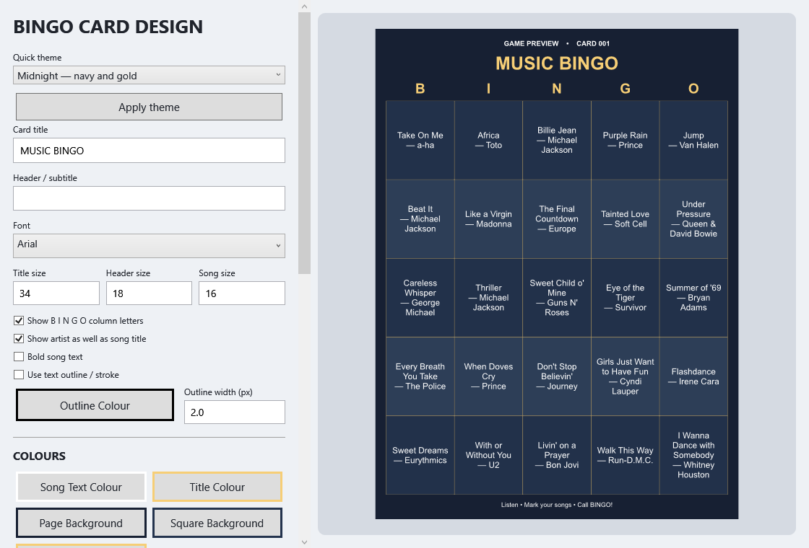
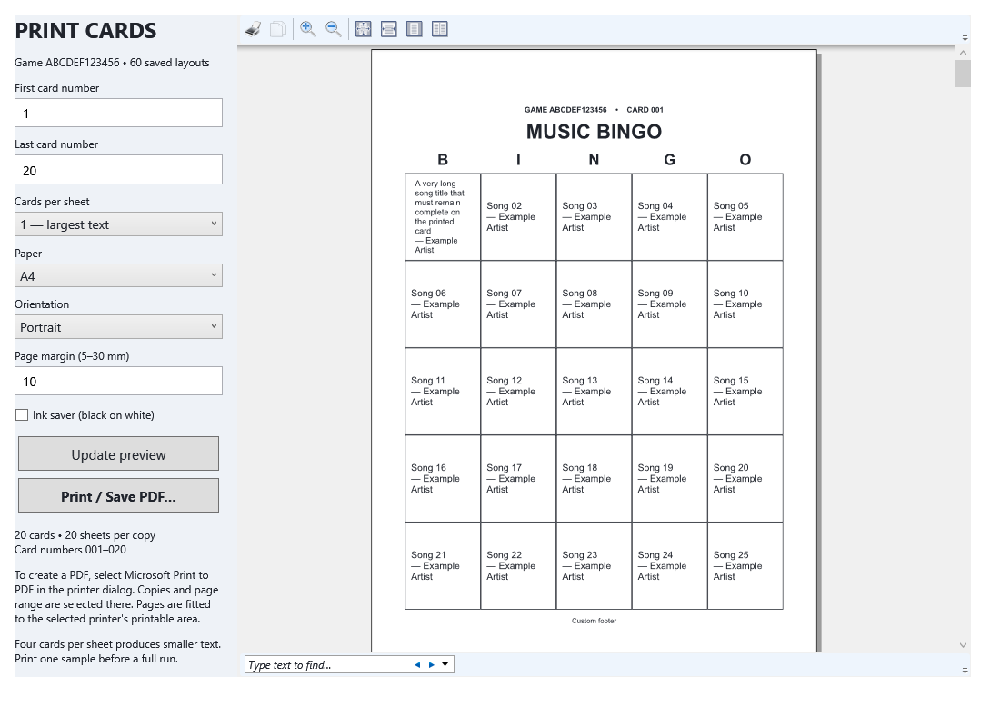

# Hazz Music Bingo v.0.1 — user guide

## Install and start

Download the Windows x64 ZIP from the [v0.1 release](https://github.com/harryoke/Hazz-Music-Bingo/releases/tag/v0.1), extract it, and run **HazzMusicBingo.exe**. The .NET runtime is included. The application is unsigned. Windows audio support and a working sound output are required. No music is included. Keep your own music on a local or reliably connected drive.

The app stores its library, games and settings in `%LOCALAPPDATA%\HazzMusicBingo`. Moving or replacing the executable does not move or erase this data. First startup creates an empty database. Later startups reopen the active game automatically.

The host window needs at least 1120 × 680 logical pixels. A second monitor is optional. A printer is optional; Windows' Microsoft Print to PDF can create PDFs instead.

## Quick start for an event

1. Select **SCAN MUSIC FOLDER** and choose the folder containing your music. Subfolders are included. Wait for the completion message.
2. Select **CHECK MUSIC / LOCATE FILES**. Clear **Current game only** to check the entire library. Resolve missing or previously unreadable files.
3. Select **GENERATE 60-SONG GAME**. At least 60 files must exist and have a positive duration recorded from scanning. The app locks those 60 songs for playback and cards.
4. Open **BINGO CARD DESIGN**, adjust the design, and select **Use Design**.
5. Open **PREVIEW / PRINT CARDS**, select your card range and paper options, review the pages, and print one sample before the complete run.
6. Select **SAVE GAME** to create a portable game file. Keep the file with the event paperwork.
7. Announce the winning pattern. Open the audience screen, select a clip length, and use **PLAY NEXT SONG**.
8. When a player calls bingo, use **CHECK WINNING CARD** and compare the printed game code before entering the card number.

## Music library and missing files

Scanning indexes MP3, WAV, WMA, M4A, AAC, FLAC and OGG filenames. Actual decoding depends on Windows Media Foundation support; an extension alone does not guarantee playback. Artist and title are derived from the filename, not embedded tags. A filename such as `Artist - Song Title.mp3` gives the clearest result.

Scanning runs in the background. The scan button is disabled until that scan finishes; there is no separate cancel button. Closing the app requests cancellation. An inaccessible directory may stop the scan; already indexed files remain available. Scanning is additive: it does not delete old database entries when a file disappears.

**Check music** lists files that are missing/inaccessible, or had no readable duration at the last scan. The current game's status also reports how many songs need attention. Generation excludes those unavailable entries. The check uses the last scan's decoding result; it does not decode every file again. If a file has changed or become corrupt, rescan it.

To reconnect a moved song:

1. Select its row in **Check music**.
2. Click **Locate selected song…**.
3. Select the same recording in its new location. The app verifies that Windows can read a positive audio duration.
4. Refresh the check. Save portable `.hmbgame` files again if they should contain the new path.

Relinking preserves the song's database identity, played status and every saved card that references it. It does not replace the song title or artist. Do not use it to substitute a different song after distributing cards. A file already assigned to another library song is rejected to avoid duplicate identities. There is no automatic duplicate merging or folder-wide remapping in this release.

## Card design

The designer and printing use the same renderer, so fonts, colours and spacing match. Select an installed font in the font list; changes apply immediately to all card text, including the game/card identifier. **Use Design** saves the design for the app. **Cancel** discards the current edit.

| Setting | Purpose |
| --- | --- |
| Quick theme | Classic, Midnight, Festival or Easy read. Click Apply theme; font and custom text remain available for editing. |
| Card title / subtitle | Event branding and instructions above the grid. Very long headings are limited to two lines. |
| Font / title / header / song sizes | One font family across the card, with independent sizes. Long song labels wrap and shrink to fit instead of being cut off. |
| BINGO letters | Show or hide the five column letters. |
| Artist | Include or omit artist names. |
| Bold text / outline | Emphasise song labels; customise outline colour and width. |
| Colours | Text, heading, page, square background and grid lines. |
| Background image | Fit an image without cropping; adjust its opacity independently of square opacity. |
| Footer | Player instructions at the bottom; limited to two lines. |
| Grid width / square padding | Change separation and white space. |
| Alternate rows / left alignment | Improve readability. Alternate shading colour comes from the selected theme. |

**Save As** writes a `.hmbdesign` preset. **Load Design** imports one. **Reset Default** resets the working design; select Use Design to keep it. Background images are referenced by path, not embedded: copy the image too when moving a preset to another computer. A missing font may be substituted by Windows on another computer.

Each card has 25 different songs and no free centre square. The first print request saves all 60 layouts, even if you print fewer. Reprinting always uses those saved layouts. No two cards use the same song at the same position; no two cards have exactly the same song set. These rules do not guarantee only one simultaneous winner.

## Print cards or create a PDF

Open **PREVIEW / PRINT CARDS** for the active game. Available options:

- First and last card number: inclusive range from 1 to 60. For example, 11–20 prints ten cards.
- One, two or four cards per sheet. Two cards stack in portrait and sit side by side in landscape; four use a 2 × 2 grid.
- A4 or US Letter; portrait or landscape.
- Page margin from 5 to 30 mm.
- Ink saver: black text and lines on white, with artwork and alternate shading suppressed for this print job. Your saved design is unchanged.

Select **Update preview** after changing options. The summary shows the card count and sheets per copy. Use the viewer toolbar to zoom and move between pages. **Print / Save PDF…** rebuilds the preview from the current options before opening the Windows printer dialog. The viewer's print command follows the same path.

In the printer dialog choose the printer, copies and optional page range. The printer page range refers to *sheets in the preview*, not card numbers. To select particular cards, use the first/last card controls before opening the printer dialog. For a PDF choose **Microsoft Print to PDF**, then select an output filename when Windows asks.

The app fits each page into the selected printer's printable area, respecting hard margins. A different printer paper size or orientation may scale the preview further. Match the printer dialog to the preview for predictable output. One card per sheet gives the largest text; four per sheet can be small, especially with long titles. Previewing is not a substitute for a physical sample print.

## Playback and the audience screen

**Play Next Song** chooses the next unplayed song. Clip lengths range from 10 to 60 seconds, with a two-second fade at the end. Short recordings finish earlier. **Stop** stops immediately. **Repeat Last** replays the previous song without adding another played entry; Next can interrupt a repeat.

A track is marked played once audio output starts successfully. A missing file or decoder/output-initialisation failure leaves it unplayed. If the host stops a clip after it starts, it remains played. An audio device failing later does not undo the played flag. There is no single-song undo or skip button in v.0.1; repair missing music and retry, or replay the last song when appropriate.

**Check Played Songs** opens an alphabetical, paged list on the host and audience screen. Next/Previous pages on the host control the audience list. Closing the list restores the current-song display.

With multiple monitors the audience window uses a non-primary screen. With one screen it opens as a normal preview window. **Audience Screen Design** changes its appearance separately from printed cards. Connect displays before opening the audience window; automatic recovery from monitor disconnection is not implemented.

## Verify a winner

Open **CHECK WINNING CARD**, compare its displayed game code with the paper card, and enter a card number from 1 to 60. Select:

- **Any row, column or diagonal**: five marked squares in a horizontal line, vertical line or either main diagonal.
- **Four corners**: all four corner songs played.
- **Full house**: all 25 songs played.

Click **Check / Refresh**. Green squares with a check mark correspond to played songs. The result reports BINGO only when the selected pattern is complete and lists any completed lines. The checker uses the active game's saved layouts and current database progress. It will not invent a card if no layouts were saved. Generate the cards through Print cards first.

Game codes help distinguish sessions, but are not anti-fraud signatures. Old cards printed by earlier builds lack a game code: use them only when you are certain the selected saved game is the original one. Reprinting with this release adds the identifier.

## Save, load, reset and recover

| Action | Cards and pool | Progress | Playback order |
| --- | --- | --- | --- |
| Save `.hmbgame` | Stored, along with game code and file paths | Stored | Written for compatibility |
| Load `.hmbgame` | Restored exactly into a new local history record | Restored | Newly shuffled, intentionally |
| Reset game to 0 | Retained | Cleared | Newly shuffled |
| New / Close Game | Remains in local history | Retained | Retained |
| Reopen from history | Same database game and saved cards | Retained | Retained exactly |

Game files do not include music, card-design settings, audience-design settings or background images. A game saved before layouts were generated contains no cards; loading it can generate a new layout set. Generate cards before saving if you need an exact printable set to travel with the file.

Loading rejects unsupported versions, duplicate songs, invalid card references and incomplete card sets. It will not silently regenerate a damaged set that may already have been distributed. Game, progress and card insertion is transactional. A failed card insert leaves the previous active game active. Track-library metadata upserts occur before that transaction.

**GAME HISTORY / RECOVERY** lists all local games with creation time, game code, status, played count and saved-card count. Select a row and **Reopen selected game**. The previous active game closes but stays in history. Imported copies can share a game code; use creation time and progress to identify the intended copy. Recovery does not restore an earlier state of the same game after a reset: use an earlier saved game or database backup for that.

## Backups and moving computers

In Game history, **Back up database…** creates a consistent SQLite backup with library paths, history, progress and cards. Choose a new filename; existing backup files are not overwritten. Back up the design JSON files and background artwork separately.

To restore an entire database backup: close all instances of the app; keep a copy of the complete existing data folder; put the backup in a **new, empty data folder**, named `hazzmusicbingo.db`, then launch with the profile override described below. This avoids mixing a restored database with old SQLite WAL/SHM sidecar files. Verify the recovered history before replacing the normal profile. A `.hmbgame` file can simply be loaded through the normal interface and is usually the easier way to move a single event.

Advanced: `HAZZ_MUSIC_BINGO_DATA_DIR` can select a separate data directory for one process. For example in PowerShell, set `$env:HAZZ_MUSIC_BINGO_DATA_DIR = 'C:\Bingo-Recovery'` and launch the executable from that terminal. Close that terminal afterwards to stop using the override. This is also how the automated checks avoid touching real data.

## Troubleshooting

| Problem | What to check |
| --- | --- |
| Fewer than 60 available songs | Scan more music, reconnect its drive and inspect Check music. Scanned duration must be positive. |
| Font seems unchanged | Choose an installed font and inspect the live preview, then Use Design. Other computers need the font installed. |
| Card text is small | Use one card per sheet, hide artists, increase song size, or reduce padding. Very long labels still shrink to fit. |
| Card number does not match a player | Check the printed game code and selected history record. Card numbers repeat between games. |
| Audio error | Check file availability, Windows default audio output and codec support; rescan or relink. |
| Missing background | Re-select the image. Presets store its path, not the image data. |
| Missing PDF printer | Enable/install Microsoft Print to PDF in Windows, or choose another available printer. |
| Save/backup fails | Use a writable folder with free space; for backups select a filename that does not already exist. |
| No previous games in history | Confirm the Windows account and data-directory override. A fresh profile has a different database. |

This release has automated logic and WPF-rendering checks. Physical audio output, physical printer drivers and mixed-DPI multi-monitor behaviour still require an event-machine rehearsal.
